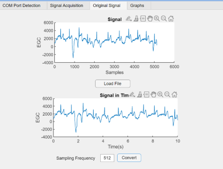
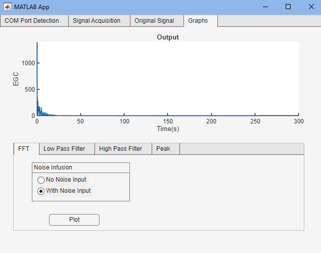
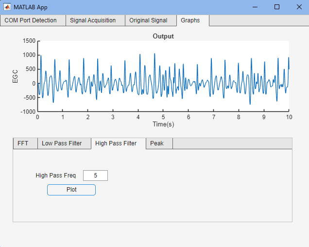
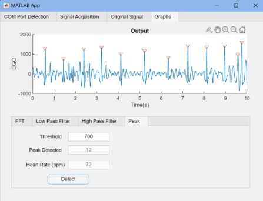

# Smart ECG Monitoring & Signal Analysis — MATLAB

A MATLAB App Designer project developed for the **Smart Healthcare Applications (EGE354)** module.

> **Note:** `ecg_module_v4_Serial.mlapp` is the original MATLAB App Designer application.  
> `ecg_module_v4_Serial_source.m` is included as a readable source-code reference for GitHub viewing.

The application was designed to acquire and analyse ECG signals using an ECG sensor connected through a serial COM port. It supports ECG visualisation, time-domain conversion, frequency analysis, signal filtering, R-peak detection and heart-rate calculation.

## Project Features

- Serial COM port detection and connection
- ECG signal acquisition
- Sample-to-time conversion
- Fast Fourier Transform (FFT)
- Low-pass filtering
- High-pass filtering
- R-peak detection
- Automatic peak counting
- Heart-rate calculation in BPM
- Interactive MATLAB App Designer interface

## Signal Acquisition and Time Conversion

The ECG signal is initially represented using sample numbers. Using the sampling frequency of **512 Hz**, the signal can be converted into a time-based representation.



This screenshot shows an ECG signal acquired during project testing using the provided ECG sensor, together with its conversion from samples to time.

## FFT Analysis

The application uses a **Fast Fourier Transform (FFT)** to analyse the frequency components of the ECG signal.

It also includes an option to introduce noise to observe its effect on the frequency spectrum.



This demonstration uses a sample ECG signal provided for the project.

## High-Pass Filtering

The application includes configurable signal filtering to remove unwanted components from ECG data.

The high-pass filter can reduce low-frequency baseline variations before further analysis.



This demonstration uses a sample ECG signal provided for the project.

## R-Peak Detection and Heart Rate

The application detects R-peaks from the ECG waveform and uses the detected peak locations to calculate heart rate.



In this example, the application detected **12 peaks** and calculated a heart rate of **72 BPM** from an ECG signal acquired during project testing.

## Application Workflow

```text
ECG Sensor
    ↓
Serial COM Port
    ↓
Signal Acquisition
    ↓
Sample-to-Time Conversion
    ↓
Signal Processing
    ├── FFT Analysis
    ├── Low-Pass Filtering
    ├── High-Pass Filtering
    └── R-Peak Detection
            ↓
      Heart Rate Calculation
```
      
## Technologies and Concepts

- MATLAB
- MATLAB App Designer
- Digital Signal Processing
- ECG Signal Analysis
- Serial COM Port Communication
- Fast Fourier Transform (FFT)
- Low-Pass Filtering
- High-Pass Filtering
- Peak Detection
- Heart-Rate Calculation
- Data Visualisation

## Requirements

To open and run the application:
- MATLAB
- MATLAB App Designer
- Signal Processing Toolbox
- ECG sensor hardware and a valid serial COM port for live signal acquisition

The physical ECG sensor used during development was provided by the school and is not included in this repository.

## Note on ECG Data

The screenshots in this repository use two sources of ECG data:
- FFT analysis and high-pass filtering use sample ECG signals provided during the project.
- Signal acquisition/time conversion and R-peak detection/heart-rate calculation use an ECG signal acquired during project testing using the provided sensor.
The professor-provided sample .mat files are not included in this public repository because permission for public redistribution has not been established.

## Academic Context

This project was completed as part of the Smart Healthcare Applications (EGE354) module in the Diploma in Electronics & Computer Engineering programme.
The project involved extending a partially developed MATLAB ECG acquisition application with signal-processing and feature-extraction capabilities.
